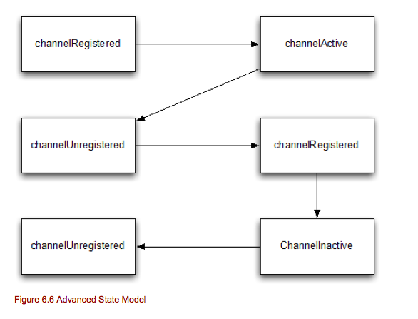

===========================
第六章 ChannelHandler
===========================
(*翻译很生硬，仅做互相学习交流使用，发现问题欢迎反馈。2014-07-14更新*)

本章内容

	* ChannelPipeline
	* ChannelHandlerContext
	* ChannelHandler
	* InBound和OutBound

接受和创建连接只是你应用程序的一部分，我们还需要编写很复制的代码去处理输入和输出的数据。

Netty 提供了很强大的方法来处理这些问题。他允许在处理数据的ChannelHandler上使用钩子。他还提供了ChannelHandler链，每个ChannelHander处理小的任务。这样有助于你写的干净和可重用的实现。

用ChnnelHandler处理数据也只是其中一个用法，你还可以用来废止I/O操作，而所有这一切都是实时的。

ChannelPipeline
==================

ChannelPipeline 是一个list,包含多个拦截和处理输入和输出操作的ChannelHandler实例。ChannelPipeline提供了拦截过滤器模式的一种高级形式，让用户完全控制如何处理事件，以及如何在ChannelPipeline的ChannelHandlers彼此交互。

对于每一新的channel,一个新的ChannelPipeline被创建和添加到channel中。一旦添加到channel中，channel和CahnnelPipeline的关联是不变的。channel不能添加其他的ChannelPipelie,也不能分离channle当前关联的ChannelPipeline。所有这些已经帮你处理了，你不需要处理他。

下图展示了ChannelHandlers在一个ChannelPipeline中典型的处理I/O流程。一个I/O操作可以被ChannelInboundHandler和ChannelOutboundHandler其中一个处理，然后通过调用ChannelInboundInvoker或者ChannleOutboundInvoker接口定义的方法转向最近的一个handler处理。ChannelPipeline扩展了他们两个。

(*新版中ChannelInboundInvoker，ChannleOutboundInvoker已废弃。使用TailContext，HeadContext内部类替代*)

从上图可以看出，ChannelPipeline主要是ChannelHandler组成的一个列表(list)。如果一个inbound I/O事件被触发，他会从ChannelPipeline开始传递到末端。对于outbount I/O 事件，他会从ChannelPipelined的末端传递到开始。ChannelPipeline通过检查类型，知道ChannelHandler能否处理这事件。如果不能处理他，他会跳过这个ChannelHandler，使用下一个匹配的ChannelHandler处理。在ChannelPipeline上的修改是实时的，这意味着你可以添加、删除、替换ChannelHandler。这允许写入灵活的逻辑，如多路复用器。在本章后面我们会更详细的说明。

现在让我们看一下怎样修改一个ChannelPipeline。

.. image:: _static/image/t6.1.png

下面代码演示了如何使用这些方法来修改ChannelPipeline.

*Listing 6.1 Modify the ChannelPipeline*
::
	ChannelPipeline pipeline = ..;
	FirstHander firstHandler = new FirstHandler();			#1
	pipeline.addLast("handler1", firstHandler);			#2
	pipeline.addFirst("handler2", new SecondHandler());		#3
	pipeline.addLast("handler3", new ThirdHandler());		#4
	
	pipeline.remove("handler3");					#5
	pipeline.remove(firstHandler);					#6

	pipeline.replace("handler2","handler4", new ForthHandler());    #7

	#1 创建一个FirstHanlder实例
	#2 添加FirstHandler实例到ChannelPipeline中。
	#3 添加SecondHandler实例到ChannelPipeline第一个位置中，这意味着他在已存在的FirstHandler前面。
	#4 添加ThirdHandle到ChannelPipeline中的最后位置。
	#5 删除名称为handler3的ThirdHanlder。
	#6 通过引用实例删除FirstHandler。
	#7 用ForthHandler替换已添加的handler2，并且命名为hander4

正如你看到的，修改ChannelPipeline很容易，并且允许你根据需求添加，删除，替换ChannelHandler。

他允许你修改ChannelPipeline，也有一些让你访问被添加的ChannelHandler实现，来检查特定的ChannelHandler是否存在ChannelPipeline中。

.. image:: _static/image/t6.2.png

ChannelPipeline 继承了ChannelInboundInvoker和ChannelOutboundInvoker，他暴露了调用inbound和outbound操作的额外方法。这些操作对于通知每一个ChannelPipeline中的ChannelInboundHandler处理不同的事件。（这些方法不再一一列出，请看API docs）

(*新版中ChannelInboundInvoker，ChannleOutboundInvoker已废弃。使用TailContext，HeadContext内部类替代。*)

ChannelHandlerContext
==========================

每当一个ChannelHandler添加到ChannelPipeline，一个新的ChannelHandlerContext会被创建并且关联他。ChannelHandlerContext 允许ChannelHandler之间交互在同一个传输下，这部分和ChannelPipline有点相同。

对于一个被添加的ChannelHandler，他的ChannelHandlerContext永远不会被改变，所以他可以从缓存中安全获取。

ChannelHandlerContext实现了ChannelInboundInvoker和ChannelOutboundInvoker。他有很多方法都出现在Channel和ChannelPipeline中。不同之处是如果你调用这些方法在Channel或者ChannelPipeline上，他们总是经过完整的ChannelPipeline。相比之下，如果你调用ChannelHandlerContext中的方法，他从当前位置开始，通知在ChannelPipeline里最近的ChannelHandler来处理事件。

通知下一个ChannelHandler
----------------------------

你可以通过调用ChannelInboundInvoker和ChannelOutbountdInvoker中的方法来通知在相同ChannelPipeline中最近的handler。从哪里开始通知，取决于你对通知的设置。

下图中显示ChannelHandlerContext是如何属于ChannelHandler和绑定到ChannelPipeline上的。

现在，如果你想有贯穿整个ChannelPipeline的事件流，这里有两个不同的方法：

	* 调用Channel上的方法
	* 调用ChannelPipeline上的方法。

这两种方法让事件流贯穿整个ChannelPipeline，从头开始还是从末尾开始贯穿ChannelPipeline要取决于事件的性质，如果是一个inbound时间，他从头开始，如果是一个outbound事件，他从尾开始。

下面代码展示一个write事件怎么从ChannelPipeline的尾端开始通过ChannelPipeline。（他是一个outbound操作）

*Listing 6.2 Events via Channel*
::
	ChannelHandlerContext ctx = ..;
	Cahnnel channel = ctx.channel();						#A
	channel.write(Unpooled.copiedBuffer("Action in Action",CharsetUtil.UTF_8)	#B
	
	#A 获取属于ChannelHandlerContext的Channel引用。
	#B 通过channel写数据。

这个消息流通过整个ChannelPipeline。你可以通过ChannelPipeline做同样的事情。如下所示

*Listing 6.3 Events via ChannelPipeline*
::
	ChannelHandlerContext ctx = ..;
	ChannelPipeline pipeline = ctx.pipeline();					#A
	pipeline.write(Unpooled.copiedBuffer("Action in Action",CharsetUtil.UTF_8)	#B

	#A 从ChannelHandlerContext 获取一个ChannlePipeline的引用
	#B 通过ChannelPipeline 写数据。

消息流通过整个ChannelPipeline。上面的两个列子在事件流关系上，她们的操作都是相等的。你也应该注意到Channel和ChannelPipeline都可以从ChannelHandlerContext访问到。

下图展示被Channel或者ChannelPipeline触发的事件流。

.. image:: _static/image/6.3.png

这里可能有几种情景，你想从ChannelPipeline指定的位置开始，不想通过整个ChannelPipeline。比如：

	* 为了节省不感兴趣的事件通过额外ChannelHandler的开销。
	* 排除一下ChannelHandler

在这种情况下，你可以使用ChannelHandlerContext，这也是你的首先起点。请注意，他会使用ChannelHandlerContext执行下一个ChannelHandler，不会使用已经执行过的ChannelHandler。

下面代码展示使用ChannelHandlerContext是如何操作的。

*Listing 6.4 Events via ChannelPipeline*
::
	ChannelHandlerContext ctx = ..;						#1
	ctx.write(Unpooled.copiedBuffer("Netty in Action", CharsetUtil.UTF_8);  #2

	#1 获取一个ChannelHandlerContext的引用。
	#2 使用ChannelHandlerContext 写入buffer。

消息流开始通过ChannelPipeline，从下一个ChannelHandler到ChannelHandlerContext。 在这种情况下，事件流使用ChannelHanlerContext开始下一个ChannelHandler。

事件流如下：

正如你看到的，他从指定的ChannelHandlerContext开始，并且跳过他之前的所有ChannelHandler。使用ChannelHandlerContext操作是常见的模式。而且很常用，如果你从ChannelHandler实现调用操作。
你也可以从外部使用ChannelHandlerContext，因为这是线程安全的。

修改ChannelPipeline
-----------------------

你可以调用pipeline()方法来访问你的ChannelHandler所属的ChannelPipeline。一个非凡的应用可以在运行时在ChannelPipeline里动态的添加，删除，或者替换ChannelHanlder。

	*注意你可以保持ChannelHandlerContext供以后使用，如触发事件以外的处理方法，甚至从不同的线程。*

下面代码演示，如此存储ChannelHandlerContext供以后使用，并且从其他线程事件使用他。

*Listing 6.5 ChannelHandlerContext usage*
::
	public class WriteHandler extends ChannelHandlerAdapter{
		private ChannelHandlerContext ctx;
		
		@Override
		public void handlerAdded(ChannelHandlerContext ctx){
			this.ctx = ctx;						#A			
		}

		public void send(String msg){
			ctx.write(msg);						#B
		}

	}

	#A 存储ChannelHandlerContext引用，为以后使用。
	#B 使用前面存储的ChannelHandlerContext 发送数据。

请注意，如果ChannelHandler实例被标注了@Sharable，他是可以被添加到很多的ChannelPipeline中。这意味着，ChannelHandler单一实例，可以有多个ChannelHandlerContext，因此他可以被不同的ChannelHandlerContext调用。

如果你试图给没有注解@sharable的ChannelHandler加入超过一个ChannelPipeline，将会抛出异常。注意，如果ChannelHandler使用了@Sharable，必须保证不同的线程安全的使用他，同时也保证不同的channel在同时使用他是安全的。让我们看看如何使用他。下面代码展示正确是shiiyong@Shareble注解。

*Listing 6.6 Valid usage of @Sharable*
::
	@Sharable
	public class SharableHandler extends ChannelInboundHandlerAdapter{

		@Override								#A
		public void channelRead(ChannelHandlerContext ctx, Object msg){
			System.out.println("Channel read message " + msg);		#B
			ctx.fireChannelRead(msg);
		}
	}

	#A 使用@Sharable注解
	#B 记录方法调用，并且转向下一个ChannelHandler。

这里使用@Sharable是有效的，因为他没有使用字段存储数据，他是无状态的。

也有糟糕使用@Shareble的，请看下面代码

*Listing 6.7 Invalid usage of @Sharable*
::
	@Sharable										#1
	public class NotSharableHandler extends ChannelInboundHandlerAdapter{
		private int count;
	
		@Override
		public void channelRead(ChannelHandlerContext ctx, Object msg){
			count ++;								#2
			
			System.out.println("channelRead(...) called the " + count + "time");    #3
			ctx.fireChannelRead(msg);
		}
	}

	#1 使用@Sharable 注解
	#2 增长count 字段。
	#3 记录方法调用，转向下一个ChannelHandler。

为什么在这里使用@Sharable 是错误的？一旦你看了这代码，你会很容易就猜出。问题就是我们使用了count这个字段来存储方法的访问次数。只要你加了相同NotSharableHandler实例到ChannelPipeline，你会得到不好的作用，比如，count字段被不同的连接（可能的线程）同时访问和修改。

@Sharable 使用规则是，你能确定在很多不同的channel重用。

The state model
===================

Netty 有一个简单但是很强大的状态模式，他完美的映射到ChannelInboundHandler方法。在后面的章节我们在看看ChannelInboundHandler。有四种不同的状态，如下所示：

	* channelUnregistered: channel已经被创建，但是没有注册到EventLoop        	     

	* channelRegistered:   channel已经注册到EventLoop	

	* channelActive:       channel是活跃状态，意味着他已经连接远端，他可以接收和发送数据

	* channelInactive:     channel已经端口远程连接

Channel的状态在他生命周期中被改变，他改变状态时会被触发。通常Channel四个状态在生命周期中的改变如下图所示。

.. image:: _static/image/6.5.png

			      
在更高级的场景中，你可以看见额外的状态变化。这是因为，用户可以从EventLoop取消Channel注册，暂停处理执行事件，并且在之后重新注册他。

在这种情况下，你可以看到超过一个的channelRegistered和channelUnregistered状态的改变。对于channelActive和channelInactive用于只有一次的状态改变，因为channel只会在一次的连接生命周期中使用。在此之后需要被回收。如果你想重新连接，你必须创建一个其他的。

用户取消注册channel从EventLoopo，然后又重新注册他，他的状态变化如下图：

你可学校到跟多的关于执行ByteBuf的操作在后面的章节，现在，记住他，我们重新看看不同的ByteBuf类型，这些非常有用。

ChannelHandlers and their types
=================================

Netty 通过ChannelHandler支持拦截操作和状态改变的反应。这使得很容易写你的自定义处理逻辑。

Netty有两个不同ChannelHanlder类型:

	* Inbound handler 处理接收数据和各种状态的改变。
	
	* Outbound handler 处理发送数据，并且允许拦截各种操作。

我们将讨论每个类型，但让我们从他们最基础的即可开始。

ChannelHandler-the parent of all
----------------------------------

Netty 用两很好的定义类型层次来展现不同的处理类型。他们的父类都是ChannelHandler。他提供了生命周期的操作，如ChannelHandler被调用，从ChannelPipeline被添加或者移除。

*Table 6.7 ChannelHandler methods*

	* handlerAdded(...)	当ChannelHandler从ChannlePipeline添加时被调用。
	* handlerRemoved(...)   当ChannelHandler从ChannlePipeline删除时被调用。
	* exceptionCaught(...)  当在ChannlePipeline处理期间发生错误时被调用。

上面每个方法的参数都是ChannelHandlerContext。这个ChannelHandlerContext是为每个添加到ChannelPipeline的ChannelHandler自动创建的。ChannelHandlerContext绑定到ChannelHandler,ChannelPipeline和Channel自己。

ChannelHandlerContext允许你安全的存取数据，对于一个本地的Channel。请参考ChannelHandlerContext章节获取更详细的信息。

Netty 为ChannelHandler提供了一个实现骨架，叫做ChannelhandlerAdapter。他提供所有方法的基本实现，所以你只要实现（覆盖）你关心的方法即可。基本上他已经处理转发事件到下一个ChannelHandler在ChannelPipeline里，直到结束。

Inbound handlers
--------------------

