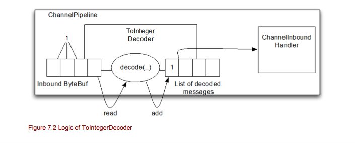
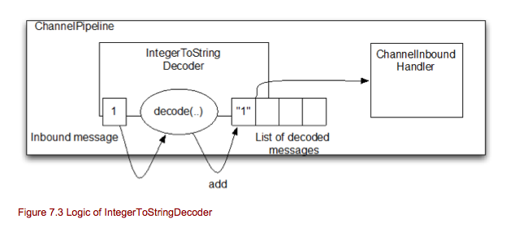

============================
第七章 Codec
============================
(*翻译很生硬，基本不通，不要浪费时间。本人也是读这本书时顺便记录下来。2014-07-17更新*)

本章覆盖内容
	* Codec
	* Decoder
	* Encoder

在上一章，你学习了各种各样的方法处理处理链的钩子和如何拦截操作或者数据。虽然ChannelHandler能够实现各种类型的逻辑，但是仍然有改进的余地。

为了满足这，Netty 提供了Codec 框架，他使得实现你的协议非常的简单，并且很容易重用和包装。

这章我们讨论code框架的不同部分以及如何使用他。

Codec(编码解码器)
====================

每当你写基于网络的程序时，你都需要实现各种编码解码器。编码解码器规定把原始的字节解析和转换成各种类型的自定义的逻辑消息。同样的也需要把消息转换成原始字节，可以在网络上传输。

记住，在网络上传输数据都是使用字节传输。一个编码解码器有两部分组成：
	* Decoder(解码器)
	* Encoder(编码器)

decoder是负责把字节解码成为消息。encoder正好相反，他负责把消息解码成字节。

我们应该清楚decoder是为inbound 处理数据，encoder是为outbound处理数据。

让我们看看decoder和encoder的各种抽象类。

Decoders(解码器)
=====================

Netty提供了很丰富的抽象类帮助你很容易的实现编写解码器。这里分为不同的类型。

	* 把字节解码成消息
	* 把消息解码成消息
	* 办消息解码成字节

本节将概述不同的抽象类，你可以使用他们来实现你的解码器，帮助你理解什么是好的解码器。

在我们投入Netty提供的实际抽象类之前，让我们定义一下解码器的职责。解码器负责把inbound数据从一种格式解码成另一种格式。因为解码器处理inbound数据，所以他是一个ChannelInboundHandler抽象类的实现。

你可以问你自己，在实践中你什么时候需要一个解码器。这非常简单，每当你在ChannelPipeline里需要传输inbound数据到下一个ChannelInboundHandler的时候。

甚至比你想象中更灵活，你可以按需要尽可能多的把解码器放到ChannelPipeline中，考虑ChannelPipeline的设计，他允许你组装可重用的组件逻辑。

ByteToMessageDecoder
------------------------

你经常想把字节解码成消息，甚至把字节解码成其他顺序的字节。这是很常见的任务，Netty已经抽象了基本的类去使用他。

这种情况你可以使用ByteToMessageDecoder。他是一个抽象的基类，让你很容易的编写解码器实现把字节解码成对象。

ByteToMessageDecoder提供了两个方法：

	* decode(): 这个抽象方法，你必须实现，他在接收所有的字节数据是被调用，并且把解码的消息加入到列表中(list)。解码一些东西时，这方法会被调用。
	* decodeLast(): 当Channel关闭时，这方法只会被调用一次，如果在这里你需要做特别处理，你可以实现这个方法。

设想一下，我们有一个从远端写入的字节流，他包含一下简单的整数，在ChannelPipeline里，我们想后面分别的处理整数，所以我们想从inbound读取整数，然后把每个整数转发到下一个ChannelInboundHandler处理。

从上图可以看出，ToIntegerDecoder从inbound ByteBuf读取数据，然后把她们解码，并且把解码后的消息(整数)转发到下一个ChannelInboundHandler。上图也显示了每个整数需要ByteBuf里的四个字节。

下面代码演示如何实现这些。

*Listing 7.3 ByteToMessageDecoder that decodes to Integer*
::
	public class ToIntegerDecoder extends ByteToMessageDecoder{							#1
		
		@Overide
		public void decode(ChannelHandlerContext ctx, ByteBuf in, List<Object> out) throws Exception{
			if(in.readableBytes() >= 4){									#2
				out.add(in.readInt());									#3		
			}
		}
	}

	#1 继承ByteToMessageDecode 实现把字节转换成消息
	#2 检查是否至少有四个字节
	#3 从inbound ByteBuf读取整数，并加入到解码消息列表中。

使用ByteToMessageDecoder使得编写从字节到消息的解码器非常容易。但是我们可能注意到令人讨厌的小事情。在你读取实际内容之前，你需要检查出入的ByteBud是否有足够的可读字节。

如果这是不必要的岂不更好?是的，这是可以的，下节我梦将讲到。

更多复杂的例子，请参考LineBasedFrameDecoder。这是Netty自己的一部分，你可以在io.netty.handler.code包里找到。此外还包含了很多其他的实现，把字节专卖成消息是经常用到的。

ReplayDecoder
-----------------

ReplayDecoder 是字节到消息对象解码的特别抽象基类。如果在每次解码数据之前，你都必须检查是否有足够的数据，这会很难实现。ReplayDecoder包装了ByteBuf，他检查是否有足够的数据准备，如果没有，抛出Signal错误，在内部检测到并处理他。一旦Signal错误抛出,解码器停止。

正因为这种包装，ReplayDecoder有些限制：

	* 不是所有的ByteBuf操作都支持，如果调用不支持的操作，将会抛出UnreplayableOperationException异常。

	* ByteBuf.readableBytes() 大多数时间都不会返回你期望的值。

如果你能接受上面的局限性，你可以使用ReplayDecoder。经验法则是，如果你使用ByteToMessageDecoder没有引入太多的复杂性，那你可以使用它，否则，应该使用ReplayingDecoder。

就像我之前说的那样，ReplayingDecoder继承了ByteToMessageDecoder，所以他暴露了同样的方法。

现在我们用ReplayingDecoder实现ToIntegerDecoder,下面代码将展示他是如何的简单。

*Listing 7.4 ReplayingDecoder decodes to integer*
::
	public class ToIntegerDecoder2 extends ReplayingDecoder<Void> {							#1
	
		@Override
		public void decode(ChannelHandlerContext ctx, ByteBuf in, List<Object> out) throws Exception {		#2
			out.add(in.readInt());
		}
	}

	#1 继承ReplayingDecoder
	#2 从inbound ByteBuf 读取整数，并且加入到解码的消息列表中。

当从inbound ByteBuf读取整数时，如果没有足够的可读字节，他会抛出一个signal错误，而且被缓存起来，所以一旦有跟多的数据decode(...)方法稍后会调用，否则把他加到消息列表中。

对比7.4和7.3代码，很容易看出那个实现更简单明确。

如果你需要实现一些更复杂的东西，你可以想象一下怎样简单的编码。同样，使用ReplayingDecoder或ByteToMessageDecoder往往是品味问题。这里一个重要的事实是，Netty为您提供了一些你可以轻松地使用的东西。你选择哪一个就看你了。

但是如果我们要吧消息对象解码成另外一个消息对象，我们该做什么？你可以使用MessageToMessageDecoder，下节我们将解释他。

对于更复杂的例子，请参考WebSocket08FrameDecoder或者在io.netty.handler.codec.http.websocketx包下的任何解码器。

MessageToMessageDecoder
----------------------------

如果你想把一个消息解码成另一个类型的消息，MessageToMessageDecoder是非常容易做到这点的。他的语义和我之前解释过其他的解码器一样。

我们再看看他的方法：

	* decode(): 这个方法仅仅是一个抽象方法，你需要实现他。对于每个inbound 需要解码的消息他都会被调用，让你把消息解码成另一个消息。解码后的消息转发到下一个ChannelInboundHandler。

	* decodeLast(): 此方法仅仅被调用一次，当Channel关闭连接时。如果你需要特别的处理，你可以覆盖此方法来实现他。

为了说明如何使用，让我们看一个例子。设想一下，你需要吧整数转换成字符串。这应该在ChannelPipeline的一部分里实现，并且分开不同解码器来实现他，这样比较灵活且可以重用。

下图是我们想实现类的实际逻辑。

这里的操作是一个消息，并不是字节。这inbound 消息是直接从decode(...)方法通过，然后解码成其他消息并且加入到解码后的消息列表中。

所以，这解码器将接收inbound消息，然后解码，最后加入到解码后的消息列表中。解码成功后，他将把解码后的消息全部转发到下一个ChannelInboundHandler。

让我们看看具体的实现我们的逻辑。

*Listing 7.5 MessageToMessageDecoder decodes integer to string*
::
	public class IntegerToStringDecoder extends MessageToMesssageDecoder<Integer> {					#1
		
		@Override
		public void decode(ChannelHandlerContext ctx, Integer msg, List<Object> out) throws Exception{
			out.add(String.valueOf(msg);									#2
		}
	}

	#1 继承MesssageToMessageDecoder
	#2 用String.valueOf()把整数转换成字符串。

在#1中，当我们实现继承MessageToMessageDecoder，把一个消息转换成另一个类型的消息是，这类型参数经常被指定输入参数，在这里，这个就是Integer类型。

更复制的例子，请参考HttpObjectAggregator，在io.netty.handler.codec.http包中可以找到。

解码器总结
--------------
你现在应该有良好的知识，知道Netty支持写解码器的基础抽象类和什么是好的解码器。解码器也只是其中一部分，这是因为大多数时间里，你也需要一种传输outbound数据的方法。这就是编码器，他是code 框架API的其他一个部分。

下一节，我们将给你跟多深入的了解如何编写你的编码器。

Encoders(编码器)
====================
*(待续)*
